This directory stores all the controllers for the project

# ENDPOINTS:

# Hospital Manager:

<table>
<thead>
    <td><strong>METHOD</strong></td>
    <td><strong>ENDPOINT</strong></td>
    <td><strong>DESCRIPTION</strong></td>
</thead>
<tr>
    <td>GET</td>
    <td>/api/v1/hospital/rooms</td>
    <td>Returns all rooms in the DB</td>
</tr>
<tr>
    <td>GET</td>
    <td>/api/v1/hospital/rooms/{id}</td>
    <td>Returns a room using its id</td>
</tr>
<tr>
    <td>GET</td>
    <td>/api/v1/hospital/rooms/number/{roomNumber}</td>
    <td>Returns a room using its room number</td>
</tr>
</table>

# Doctor:

<table>
<thead>
    <td><strong>METHOD</strong></td>
    <td><strong>ENDPOINT</strong></td>
    <td><strong>DESCRIPTION</strong></td>
</thead>
<tr>
    <td>GET</td>
    <td>/api/v1/doctors</td>
    <td>Returns all doctors in the DB</td>
</tr>
<tr>
    <td>GET</td>
    <td>/api/v1/doctors/{id}</td>
    <td>Returns doctor that matches the given id</td>
</tr>
<tr>
    <td>GET</td>
    <td>/api/v1/doctors/{id}/patients</td>
    <td>Returns patients assigned to a specific doctor</td>
</tr>
<tr>
    <td>POST</td>
    <td>/api/v1/doctors</td>
    <td>Creates a doctor according to what is in the body of the request</td>
</tr>
<tr>
    <td>PUT</td>
    <td>/api/v1/doctors/{id}</td>
    <td>Edits the doctor specified in the id according to what is in the body of the request</td>
</tr>
<tr>
    <td>DELETE</td>
    <td>/api/v1/doctors/{id}</td>
    <td>Deletes the specified doctor from the DB</td>
</tr>
</table>

# Nurse:

<table>
  <thead>
    <tr>
      <td><strong>METHOD</strong></td>
      <td><strong>ENDPOINT</strong></td>
      <td><strong>DESCRIPTION</strong></td>
    </tr>
  </thead>
  <tbody>
    <tr>
      <td>GET</td>
      <td>/api/v1/nurses/{nurse_id}/patients</td>
      <td>Returns the list of patients with vitals assigned to the specified nurse.</td>
    </tr>
    <tr>
      <td>GET</td>
      <td>/api/v1/nurses/{nurse_id}/rooms</td>
      <td>Returns all rooms associated with the specified nurse.</td>
    </tr>
    <tr>
      <td>GET</td>
      <td>/api/v1/nurses</td>
      <td>Returns a list of all nurses.</td>
    </tr>
    <tr>
      <td>GET</td>
      <td>/api/v1/nurses/{id}</td>
      <td>Returns details of the nurse specified by the given ID.</td>
    </tr>
    <tr>
      <td>POST</td>
      <td>/api/v1/nurses/{nurseId}/schedule</td>
      <td>Adds a new schedule entry for the specified nurse.</td>
    </tr>
    <tr>
      <td>POST</td>
      <td>/api/v1/nurses</td>
      <td>Creates a new nurse with the details provided in the request body.</td>
    </tr>
    <tr>
      <td>PUT</td>
      <td>/api/v1/nurses/{id}</td>
      <td>Updates information for the nurse specified by the given ID.</td>
    </tr>
    <tr>
      <td>PUT</td>
      <td>/api/v1/nurses/{nurseId}/schedule/{before_entryId}</td>
      <td>Updates an existing schedule entry for the specified nurse.</td>
    </tr>
    <tr>
      <td>DELETE</td>
      <td>/api/v1/nurses/{nurseId}/schedule/{entryId}</td>
      <td>Removes a schedule entry from the specified nurse.</td>
    </tr>
    <tr>
      <td>DELETE</td>
      <td>/api/v1/nurses/{id}</td>
      <td>Deletes the nurse specified by the given ID.</td>
    </tr>
  </tbody>
</table>

# Patient:

<table>
<thead>
    <td><strong>METHOD</strong></td>
    <td><strong>ENDPOINT</strong></td>
    <td><strong>DESCRIPTION</strong></td>
</thead>
<tr>
    <td>GET</td>
    <td>/api/v1/patients</td>
    <td>Returns all patients in the DB</td>
</tr>
<tr>
    <td>GET</td>
    <td>/api/v1/patients/{id}</td>
    <td>Returns patient that matches the given id</td>
</tr>
<tr>
    <td>GET</td>
    <td>/api/v1/patients/{id}/medications</td>
    <td>Returns medications assigned to a specific patient</td>
</tr>
<tr>
    <td>POST</td>
    <td>/api/v1/patients</td>
    <td>Creates a patient according to what is in the body of the request</td>
</tr>
<tr>
    <td>POST</td>
    <td>/api/v1/patients/{id}/medications</td>
    <td>Assigns a medication to a specific patient</td>
</tr>
<tr>
    <td>POST</td>
    <td>/api/v1/patients/{id}/medications/{medicationId}</td>
    <td>Edits the medication assigned to the patient</td>
</tr>
<tr>
    <td>PUT</td>
    <td>/api/v1/patients/{id}</td>
    <td>Edits the patient specified in the id according to what is in the body of the request</td>
</tr>
<tr>
    <td>DELETE</td>
    <td>/api/v1/patients/{id}/</td>
    <td>Deletes the patient that matched the id</td>
</tr>
<tr>
    <td>DELETE</td>
    <td>/api/v1/patients/{id}/medications/{medicationId}</td>
    <td>Deletes the medication assigned to the patient</td>
</tr>
</table>

# Notification:

<table>
<thead>
    <td><strong>METHOD</strong></td>
    <td><strong>ENDPOINT</strong></td>
    <td><strong>DESCRIPTION</strong></td>
</thead>
<tr>
    <td>GET</td>
    <td>/api/v1/notifications/user/{userId}</td>
    <td>Returns all notifications for the user with the specified id</td>
</tr>
<tr>
    <td>POST</td>
    <td>/api/v1/notifications/user/{userId}</td>
    <td>Sends a notification to the user with the specified id</td>
</tr>
<tr>
    <td>DELETE</td>
    <td>/api/v1/notifications/{id}</td>
    <td>Returns all notifications for the user with the specified id</td>
</tr>

</table>

# Users:

<table>
<thead>
    <td><strong>METHOD</strong></td>
    <td><strong>ENDPOINT</strong></td>
    <td><strong>DESCRIPTION</strong></td>
</thead>
<tr>
    <td>POST</td>
    <td>/api/v1/auth/login</td>
    <td>Login using username and password</td>
</tr>
<tr>
    <td>POST</td>
    <td>/api/v1/users</td>
    <td>Create an account with a username, password, name and email</td>
</tr>
</table>

# Visitor:

<table>
<thead>
    <td><strong>METHOD</strong></td>
    <td><strong>ENDPOINT</strong></td>
    <td><strong>DESCRIPTION</strong></td>
</thead>
<tr>
    <td>POST</td>
    <td>/api/v1/visitors</td>
    <td>Checks if the visitor is allowed to enter the hospital</td>
</tr>
<tr>
    <td>POST</td>
    <td>/api/v1/visitors/checkcode</td>
    <td>Checks if the user inserted the correct code</td>
</tr>
</table>

# Some screenshots we took to test the application:

## Create an user

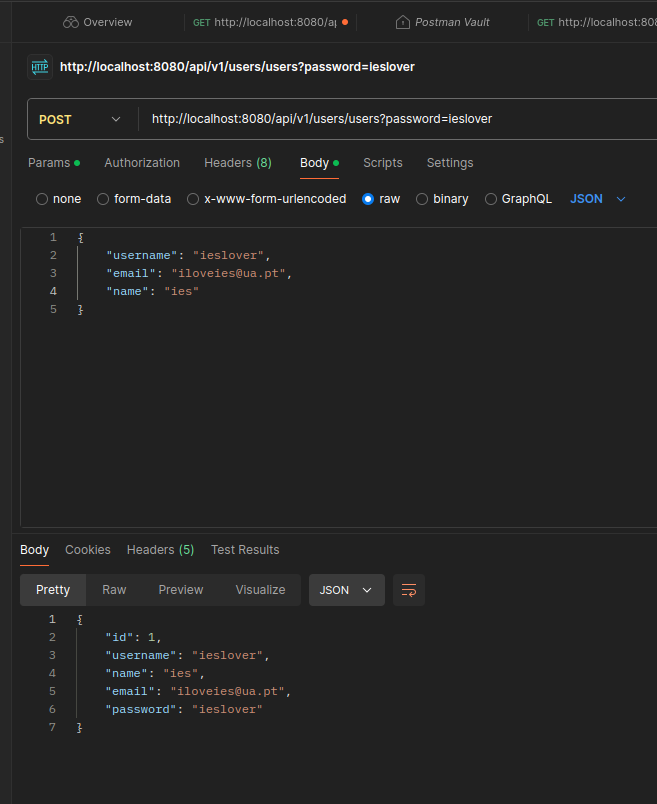

## Login

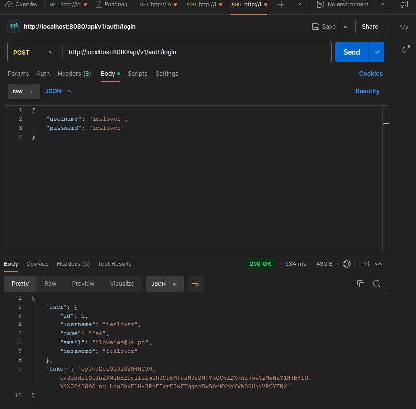

## Add Rooms

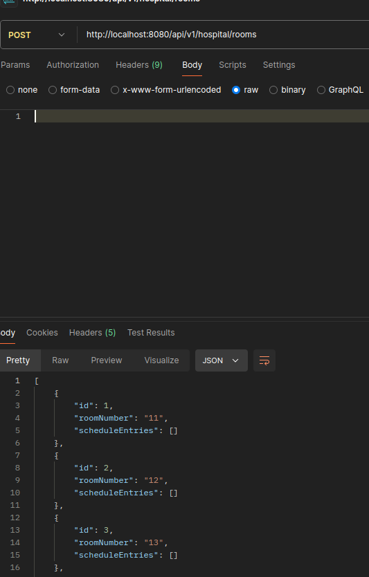

## View Rooms

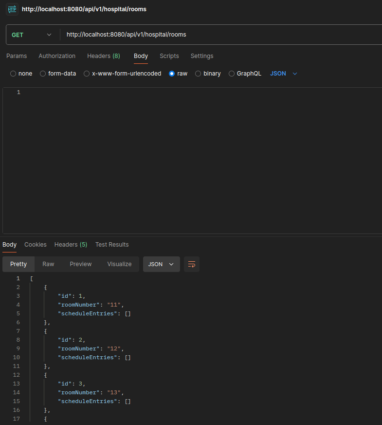

## Add a Patient

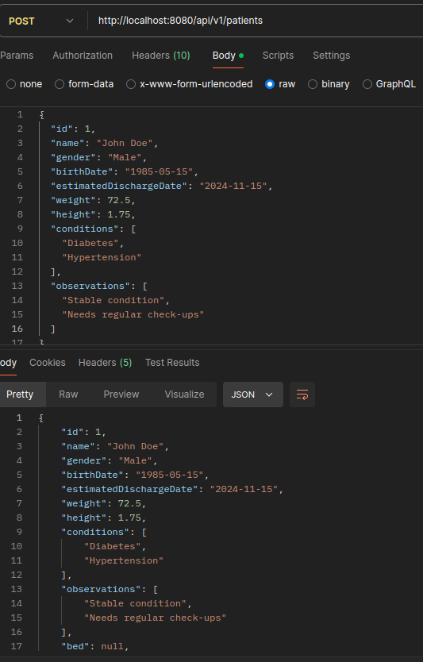

## View Patients

## Associate a patient to a bed

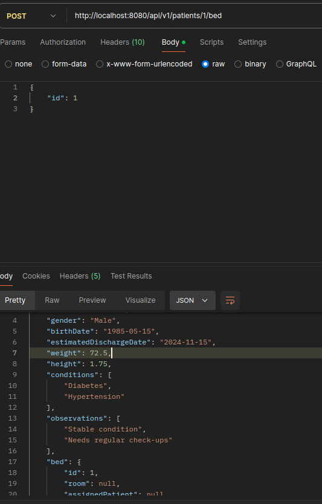

## Add a medication to a patient

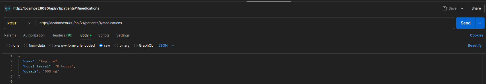

## View Medications

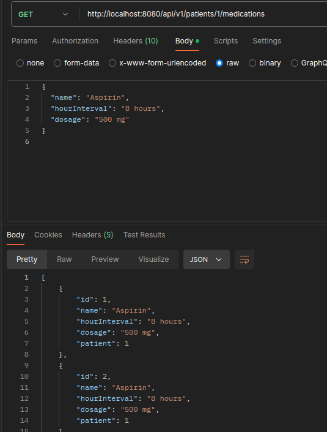

## Create a doctor

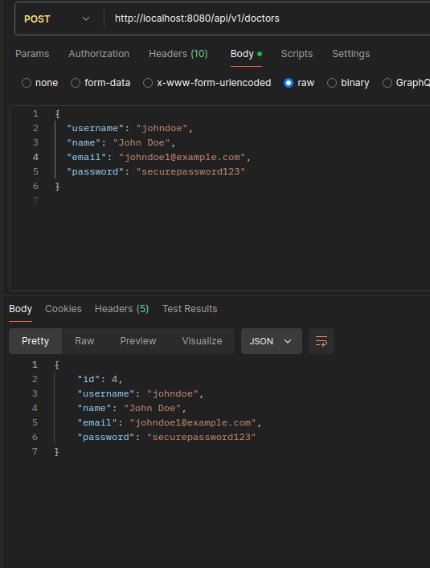

## Add a doctor to a patient

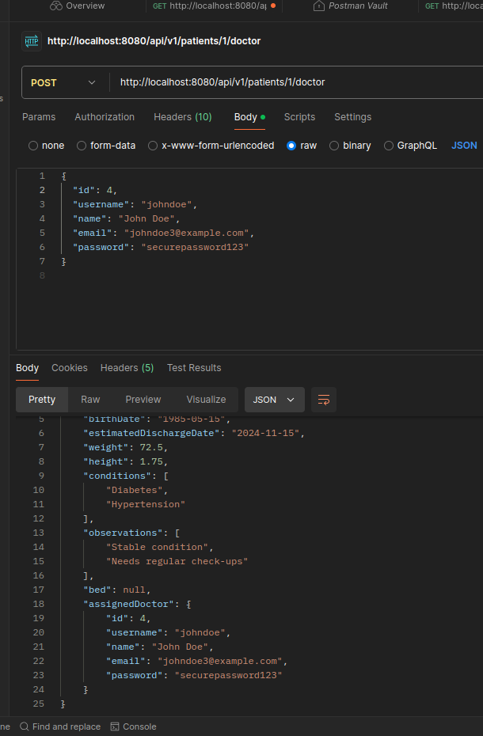

## Add notification to a patient

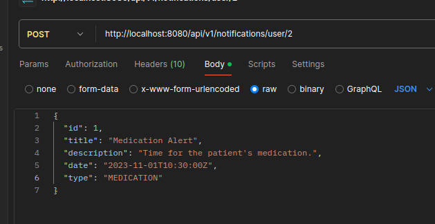

## See notifications from a user

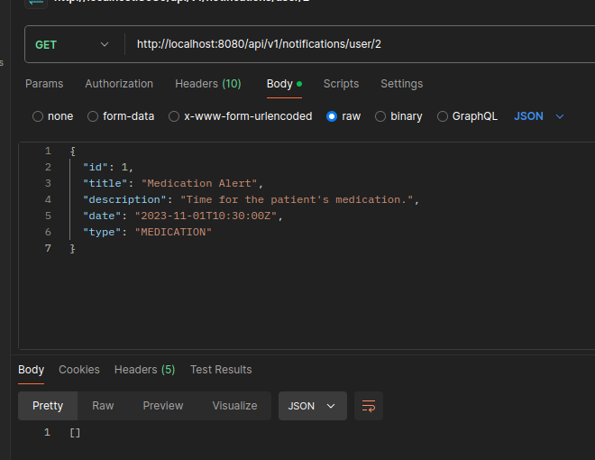
