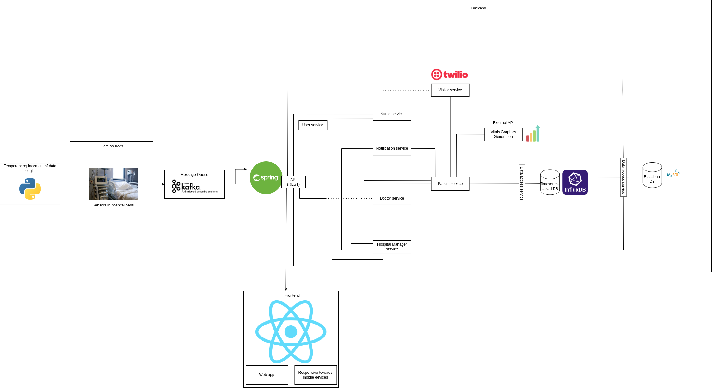

# IES_Project_103

Repository for the IES course project.

| Student         | Roles         | Nmec   | Effort |
| --------------- | ------------- | ------ | ------ |
| Pedro Ponte     | DevOps Master | 98059  | 23%    |
| Afonso Ferreira | Team Manager  | 113480 | 32%    |
| João Neto       | Product Owner | 113482 | 22%    |
| Ricardo Antunes | Architect     | 115243 | 23%    |


# Abstract

MediSync is a multi-layered service that helps with hospital management by integrating various functionalities that help with room/patient management and provide real-time patient information to help nurses and doctors deliver optimal care.

# Structure

```
.
├── MediSync/                   -- Main project folder
│   ├── docker-compose.yml      -- Docker compose file
│   ├── Dockerfile              -- Dockerfile for the backend
│   ├──src/                     -- Backend source code
│   ├──frontend/                -- Frontend source code
│       ├── Dockerfile.frontend -- Dockerfile for the frontend
│
├── minutes/                    -- Minutes of the meetings
├── presentations/              -- Materials used in the presentations
├── README.md                   -- Context
├── reports/                    -- Project specifications
├── resources/                  -- Images and other resources
```

# Architecture



# Bookmarks

- [Project Backlog](https://github.com/orgs/detiuaveiro/projects/36)
- [Swagger Documentation](http://deti-ies-03.ua.pt:8081) (Only accessible in UA network)
- [Project Specification](https://docs.google.com/document/d/1tQDygzr5BqsrD6KjLpmHCv5LkqOf6NXBRIUHFjIf3P4/edit?usp=sharing)
